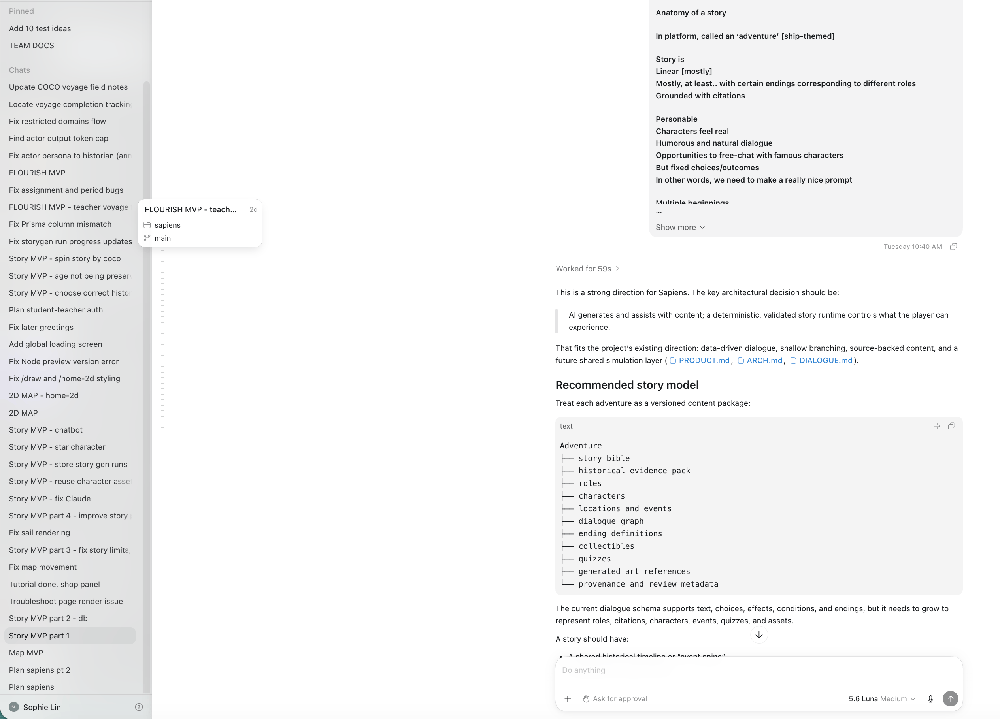

# sapiens

experience humanity. the only way to move forwards is to look back

**_a voyage is.._**

an adventure where you travel back in time to a particular historical period or event. they can be assigned by the captain (teacher) of your fleet (classroom) or created by as a solo adventure.

**_the starstream is.._**

a forum where you can share and reply to discoveries and takeaways from voyages and historical eras with fellow cadets (students)

**_stars are.._**

mystical manifestations of people from the past. they have landed in your ship to communicate with you, and help you understand humanity by starting at the very beginning.

**_your mission.._**

to remember humanity. set in a world far far away in the future, humans are tasked with.

that's the in-game answer, anyway. what about the real world?

we want you to love learning, and not get dulled by standardized education. to develop a love for the world and what it took to get here, and to make you believe in a brighter future.

**_our mission.._**

to make education feel real. to make kids lifelong learners.

**_so what are you waiting for, cadet?_**

try sapiens now at [sapiens.sophli.in](http://sapiens.sophli.in)

the stars look forward to your arrival.


## pages

`/` auraful hero page

`/nexus` share discoveries with fellow cadets

`/ship` your home

`/sail` sail away to a new world

`/home` chat with stars of the past

## how codex & gpt 5.6 was used

`codex` was used to code the platform and come up with ideas for product & architecture. i found that it works very well for generating core functionality, solving quite a few tricky bugs without hallucination or cyclic failures where it keeps repeating the same solution, and ui eval via preview. it's a lot faster than cursor and feels nicer to use, especially with the new gpt 5.6 models. even when it doesn't get the specs in one shot and forgets certain details, it's easy to ask it to fix in subsequent fixes.

it was also nice to use to generate mock data and come up with different free-text prompts to run the story gen processes on to cover edge cases, as well as one-shot design ui when i wasn't too sure how it shape out and shape from there.

i tried creating a fleet of agents (orchestrator, designer, dev, eval, housekeeper) in [`.brain/team`](.brain/team) to build the platform at some point early on, though i had to experiment with the level and type of task to see what it would be good for. sometimes the subagents would time out too early, but maybe that was some config on my end i could fixed.

overall pretty pleased by codex's results and will definitely be using it to build future projects.

`gpt 5.6` model was used when developing in codex, i did not use any other models. i used `gpt 5.6 luna` medium and high mode for different tasks. i also tried `sol` but didn't try it enough to figure the difference; `luna` was sufficient for my tasks.

the model `gpt 5.6 luna` was used in the story-generation _steering_ multi-agent workflow and other llm functions that make _sapiens_ come alive, but also keep stories and answers about historical events grounded.

below you can see all the main codex chats (some minor fix chats were archived) used to create the project. a good mix of technical implementation and design discussion used for codex.



## making sapiens

### tech

[openai](https://openai.com) & [anthropic](https://www.anthropic.com) for llms

[pixellab](https://www.pixellab.ai) for pixel art gen

### core logic

_steering_ is the core functionality that makes _sapiens_ possible. it's a multi-agent workflow that creates a story based on a historical event grounded in real sources. the user does not need to specify anything, they can simply type in any freeform text and steering will drive that thought into structure.

optionally, an attached lesson plan can be created in steering for classroom assignments.

to best understand how `sapiens` works, examine the following docs:

- steering doc (`.brain/features/STEER.md`)[.brain/features/STEER.md]
- agent prompts (`src/lib/prompts`)[src/lib/prompts].
- dialogue doc (`.brain/features/DIALOGUE.md`)[.brain/features/DIALOGUE.md]

### dev-tools

`/steer` plan voyages

`/voyages` view voyages

`/draw` create map layouts

[d] to debug on certain pages (`/ship`, `/nexus`, `/home`)

## dev

### install pnpm (if you don't already have it)

`pnpm` is a package manager built on top of npm and is much faster than npm, being highly disk efficient and solving inherent issues in npm.

install `pnpm` if you don't already have it:

```bash
npm install -g pnpm
optional: set up a shorter alias like pn instead
```

for POSIX systems, add the following to your `.bashrc`, `.zshrc`, or `config.fish`:

```bash
alias pn=pnpm
```

for Powershell (Windows), go to a Powershell window with admin rights and run:

```bash
notepad $profile.AllUsersAllHosts
```

in the profile.ps1 file that opens, put:

```bash
set-alias -name pn -value pnpm
```

now whenever you have to run a `pnpm` cmd, you can type in `pn` (or whatever alias you created) instead.

### init

create `.env.local` ref. [.env.example](.env.example)

### run

```
pnpm dev
```
